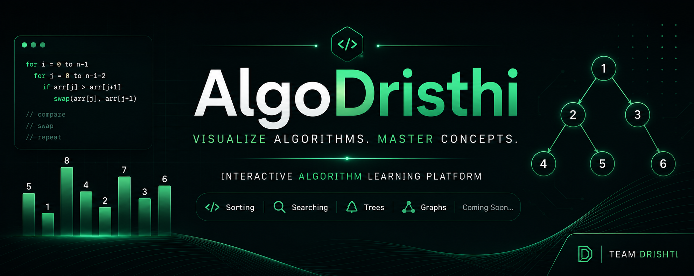

<p align="center">
  
</p>

<br>

<div align="center">


</div>

---

# 📖 About

**AlgoDrishti** is an educational platform built to simplify the learning of **Data Structures and Algorithms** through interactive visualizations.

Instead of memorizing code, learners can observe every comparison, swap, variable update, and execution step to understand how algorithms actually work.

The current version focuses on providing an interactive **Bubble Sort Visualizer** that allows users to learn Bubble Sort in a visual and beginner-friendly way.

---

# 🎯 Vision

> **Making Algorithms Easy to See, Easy to Understand, and Easy to Learn.**

AlgoDrishti aims to become a platform where students can build a strong understanding of algorithms through visualization rather than memorization.

---

# ✨ Features

- ✅ Interactive Bubble Sort Visualization
- ✅ Random Array Generation
- ✅ Step-by-Step Execution
- ✅ Previous & Next Navigation
- ✅ Variable Panel
- ✅ Variable Snapshot System
- ✅ Algorithm Status Panel
- ✅ Pseudocode Highlighting
- ✅ Bubble Sort Optimization (Early Exit)
- ✅ Responsive & Clean User Interface

---

# 🛠 Tech Stack

| Category        | Technologies                  |
| --------------- | ----------------------------- |
| Frontend        | HTML5, CSS3, JavaScript (ES6) |
| Version Control | Git & GitHub                  |
| Code Editor     | Visual Studio Code            |

---

# 📂 Project Structure

```text
ALGO_DRISTHI/
│
├── assets/
├── css/
├── html/
├── js/
│   ├── bubbleSort.js
│   ├── renderer.js
│   └── utils.js
│
├── index.html
├── README.md
└── .gitignore
```

---

# ⚙️ How It Works

```text
Generate Random Array
        │
        ▼
Start Visualization
        │
        ▼
Compare Adjacent Elements
        │
        ▼
Swap if Required
        │
        ▼
Update Variables
        │
        ▼
Highlight Pseudocode
        │
        ▼
Display Algorithm Status
        │
        ▼
Continue Until Array Is Sorted
```

---

# 🚀 Getting Started

## Clone the Repository

```bash
git clone https://github.com/ashish-jonnada/ALGO_DRISTHI.git
```

## Navigate to the Project

```bash
cd ALGO_DRISTHI
```

## Run the Project

Simply open **index.html** in your preferred web browser.

No installation or additional dependencies are required.

---

# 🤝 Contributing

Contributions, suggestions, and improvements are always welcome.

If you'd like to contribute:

1. Fork the repository.
2. Create a new branch.
3. Commit your changes.
4. Push the branch.
5. Open a Pull Request.

---

# 👨‍💻 Contributors

| Name           | Role                                                                                            |
| -------------- | ----------------------------------------------------------------------------------------------- |
| **J. Ashish**  | Project Lead • Frontend Development • Bubble Sort Logic • Project Architecture • Git Management |
| **A. Pallavi** | UI/UX Design • Styling • Interface Improvements • Visual Enhancements                           |

---

# 📄 License

This project is licensed under the **MIT License**.

---

<div align="center">

### 

### **See Algorithms. Understand Concepts.**

⭐ If you like this project, consider giving it a **Star** on GitHub!

</div>
